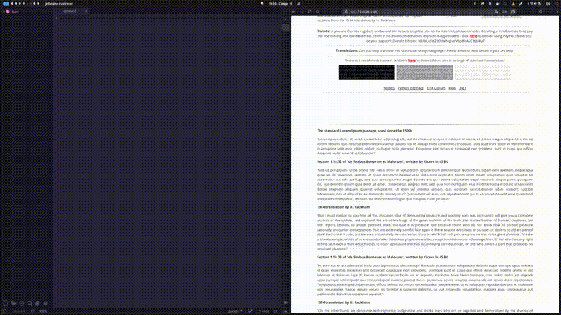

# Example usage

You can bind hotkey to call something like this

```
textify | wl-copy
```
to pass result to your clipboard.



# About

This project allows u to easily scrap text from images, or other sources where you can not just select text.

# Requirements

```bash

yay -S grim slurp tesseract tesseract-data-eng tesseract-data-rus

```

# Build

```bash
cargo build --release
```

# Installation

```bash
git clone https://github.com/enk-it/Textify.git
cd Textify

cargo build --release

chmod +x ./target/release/textify
sudo cp ./target/release/textify /usr/local/bin/ 
```

# Uninstallation

```bash
sudo rm /usr/local/bin/textify
```

